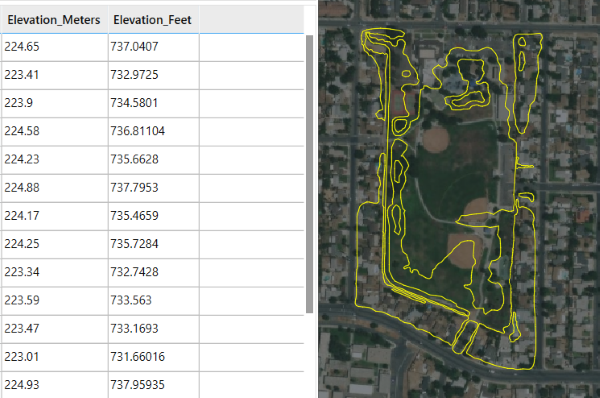
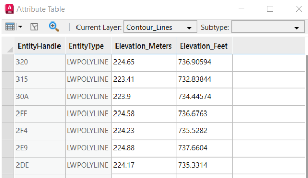

# Calculate New Field 

This sample calculates the values of a new attribute field by applying a mathematical expression onto the values of other fields.



## Description
This example reads elevation values in meters from an exisitng attribute field, creates a new field, and converts these values to feet. The drawing includes a document feature layer for contour lines in Riverside, CA. 


## Use the sample
1. Open the [UnitConversion_Sample.dwg](UnitConversion_Sample.dwg) file and load the [UnitConversion.lsp](UnitConversion/UnitConversion.lsp)  file.

2. To better understand our sample drawing, open the attribute table of the "Contour_lines" layer review the list of attributes and field names.

    

    

4. To calculate the new field run the ```UNITCONVERSION``` command. Use "3.28024" as the multiplication factor to go from meters to feet. Give the field a new name such as "Elevation_Feet".
   
9. The ArcGIS for AutoCAD attribute table is successfully updated with the elevation values in feet.
   
    

## How it works

1. Get the following info from the user: Name of feature layer, name of existing field, name of new field, conversion factor
2. Create a new empty attribute field using ```esri_fielddef_add```
3. Create a selection set of each entity in the feature layer using ```esri_featurelayer_select```
4. Get the value of each entitles elevation field using ```esri_attributes_get```
5. Convert the value to feet using the conversion factor
6. Add the converted value to field by using ```esri_attributes_set```

## Sample AutoLISP

ArcGIS for AutoCAD AutoLISP sample UnitConversion.lsp
```LISP
;@@@@@@@@@@@@@@@@@@@@@@@@@@@@@@@@@@@@@@@@@@@@@@@@@@@@@@@@@@@@@@@@@@@@@@@@@@@@@@@@@@@@@@@@@@@@@@@@@@@@
; This sample creates and populates a new field with values calculated from another field using a conversion factor
;@@@@@@@@@@@@@@@@@@@@@@@@@@@@@@@@@@@@@@@@@@@@@@@@@@@@@@@@@@@@@@@@@@@@@@@@@@@@@@@@@@@@@@@@@@@@@@@@@@@@

(defun c:unitConversion ()
  
  ; Get and select the feature layer
  (setq featureLayer (getstring "Enter the Feature Layer name : "))
  (setq featureLayerSelection (esri_featurelayer_select featureLayer))
  (setq featureLayerLength (sslength featureLayerSelection))
  
  ; Get the name of the attribute field containing the original values and the conversion factor for the new units
  (setq originField (getstring "Enter the origin field name : "))
  (setq multiplier (atof(getstring "Enter the conversion factor : ")))
  
  ; Name and create a new float attribute field to hold the newly calculated values
  (setq destField (getstring "Enter name for new field to be created : "))
  (esri_fielddef_add featureLayer
    (list
      (cons "name" destField)
      (cons "Type" "Float")
    )
  )
  
  ; Loop through each entity in the feature layer
  (setq entCount 0)
  (repeat featureLayerLength 
    (setq ss (ssadd))
    (setq entName (ssname featureLayerSelection entCount))
    (ssadd entName ss)
    
    ; Get the value of the source attribute, convert to a float
    (setq fieldAttributeOrigin
      (esri_attributes_get entName 
        (list 
          (cons "FLNAME" featureLayer)
          (cons "FIELDNAME" originField)
        )
      )
    )    
    (setq originValue (cdr (car fieldAttributeOrigin)))        
    (cond ((= (type originValue) 'STR) (setq originValue (atof originValue))))
    
    ; Multiple the source attribute by the conversion factor and set it as the new field value. 
    (setq destValue (* multiplier originValue))
    (esri_attributes_set
      entName
      featureLayer
      (list 
        (cons destField destValue)
      )
    )
    
    (setq entCount (+ 1 entCount))
  )
)
```
## Relevant API

_The **unitConversion** sample command uses the following ArcGIS for AutoCAD Lisp API functions:_

- [esri_featurelayer_select](https://doc.arcgis.com/en/arcgis-for-autocad/latest/commands-api/esri-featurelayer-select.htm) – This function returns an AutoCAD selection set filtered by the specified feature layer.

- [esri_fielddef_add](https://doc.arcgis.com/en/arcgis-for-autocad/latest/commands-api/esri-fielddef-add.htm)- This function adds a new field definition to an existing document feature layer.

- [esri_attributes_get](https://doc.arcgis.com/en/arcgis-for-autocad/latest/commands-api/esri-attributes-get.htm) – This function gets an associated list of the field names and their attribute value.

- [esri_attributes_set](https://doc.arcgis.com/en/arcgis-for-autocad/latest/commands-api/esri-attribute-set.htm) – This function adds or modifies feature attributes on an entity of a feature layer.
