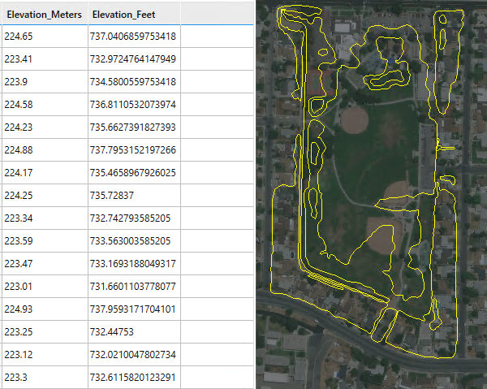
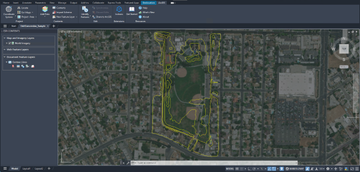
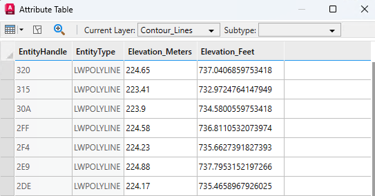

# Calculate New Field 

This sample calculates the values of a new attribute field by applying a mathematical expression onto the values of other fields.



## Description
This example reads elevation values in meters from an existing attribute field, creates a new field, and converts these values to feet. The drawing includes a document feature layer for contour lines in Riverside, CA. 



## Use the sample
1. Open the [CalculateNewField_Sample.dwg](CalculateNewField_Sample.dwg) drawing and load the dll you built in Visual Studio.

2. To better understand our sample drawing, open the attribute table of the "Contour_Lines" layer and review the list of attributes and field names.

3. To calculate the new field, run the ```AFA_Samples_CalculateNewField``` command. The multiplication factor to go from meters to feet is `3.28084` and the new field is named "Elevation_Feet".
   
4. The ArcGIS for AutoCAD attribute table is successfully updated with the elevation values in feet.
       
    

## How it works

1. Create a new empty attribute field using [`FieldDefinition.Add`](https://doc.arcgis.com/en/arcgis-for-autocad/latest/commands-api/fielddefinitionadd-net.htm)
2. Create a selection set of each entity in the feature layer using [`FeatureLayer.Select`](https://doc.arcgis.com/en/arcgis-for-autocad/latest/commands-api/featurelayerselect-net.htm)
3. Get the value of each entity's elevation field using [`Attributes.Get`](https://doc.arcgis.com/en/arcgis-for-autocad/latest/commands-api/attributesget-net.htm)
4. Convert the value to feet using the conversion factor
5. Assign the converted value to the new field by using [`Attributes.Set`](https://doc.arcgis.com/en/arcgis-for-autocad/latest/commands-api/attributesset-net.htm)

## Relevant API

_The **AFA_Samples_CalculateNewField** sample command uses the following ArcGIS for AutoCAD .NET API methods:_
- [```FieldDefinition.Add```](https://doc.arcgis.com/en/arcgis-for-autocad/latest/commands-api/fielddefinitionadd-net.htm)- This method adds a new field definition to an existing document feature layer.

- [```FeatureLayer.Select```](https://doc.arcgis.com/en/arcgis-for-autocad/latest/commands-api/featurelayerselect-net.htm) – This method returns an AutoCAD selection set filtered by the specified feature layer.

- [```Attributes.Get```](https://doc.arcgis.com/en/arcgis-for-autocad/latest/commands-api/attributesget-net.htm) – This method gets a dictionary of the field names and their attribute values.

- [```Attributes.Set```](https://doc.arcgis.com/en/arcgis-for-autocad/latest/commands-api/attributesset-net.htm) – This method adds or modifies feature attributes on an entity of a feature layer.

