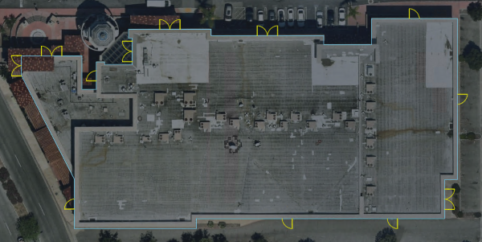
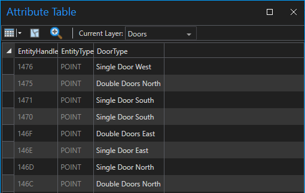
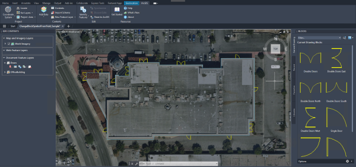

# Change Block Symbol from Field

This sample routine applies different block symbols to points or block references based on an attribute field. 



## Description
This example changes door symbols on a commercial building in Redlands, California. Using the ArcGIS for AutoCAD API, block references are set to block symbols based on attribute values. The accompanying sample drawing includes a document feature layer of exterior door locations on a building in Redlands. 

## Use the sample
1. Open the [ChangeBlockSymbolFromField_Sample.dwg](ChangeBlockSymbolFromField_Sample.dwg) file and load the [ChangeBlockSymbolFromField.lsp](ChangeBlockSymbolFromField.lsp) file.

2.	To better understand the sample drawing, explore the attribute table of the **Doors** feature layer and the current drawing blocks. The attribute table contains a **DoorType** attribute field of block symbol names.

    

3.	To change the block symbols to represent their door types, run the ```AFA_Samples_ChangeBlockSymbolFromField``` command.

4.	The doors are updated with the door blocks. 
    
    

## How it works
1. Gets the name of the feature layer and the field from the user
2. Uses [```esri_featurelayer_select```](https://doc.arcgis.com/en/arcgis-for-autocad/latest/commands-api/esri-featurelayer-select.htm) to get a selection set of all the points on the feature layer
3. Uses [```esri_attributes_get```](https://doc.arcgis.com/en/arcgis-for-autocad/latest/commands-api/esri-attributes-get.htm) to read the **DoorType** field value from every point
4. Sets the **DoorType** attribute value as the block reference using [```esri_feature_changeElementType```](https://doc.arcgis.com/en/arcgis-for-autocad/latest/commands-api/esri-feature-changeelementtype.htm)

## Relevant API

_The **AFA_Samples_ChangeBlockSymbolFromField** sample command uses the following ArcGIS for AutoCAD Lisp API functions:_

- [```esri_featurelayer_select```](https://doc.arcgis.com/en/arcgis-for-autocad/latest/commands-api/esri-featurelayer-select.htm) – This function returns an AutoCAD selection set filtered by the specified feature layer.

- [```esri_attributes_get```](https://doc.arcgis.com/en/arcgis-for-autocad/latest/commands-api/esri-attributes-get.htm) – This function gets an associated list of the field names and their attribute values.

- [```esri_feature_changeElementType```](https://doc.arcgis.com/en/arcgis-for-autocad/latest/commands-api/esri-feature-changeelementtype.htm) – This function changes the element type of a selection set of features.
