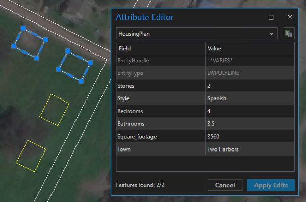
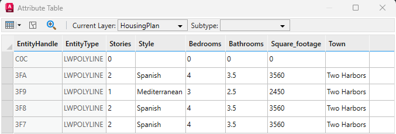
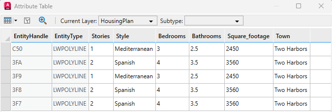

# Copy Attributes

This sample copies the ArcGIS for AutoCAD attributes from one entity and adds them to another.



## Description

This sample AutoLISP command function copies and applies ArcGIS for AutoCAD building attributes from one house to another on housing plans for Catalina Island. 

The AutoCAD sample drawing contains a document feature layer comprised of polygons for a few new homes on Catalina Island. A document feature layer with roads in the area is included for additional context. 

## Explore the sample

1. Open the [CopyAttributes_Sample.dwg](CopyAttributes_Sample.dwg) drawing and load the [CopyAttributes.lsp](CopyAttributes.lsp) file.

2. Add a new house to our housing plan by drawing a closed polyline on the AutoCAD layer "Houses".

3. To better understand our sample drawing, open the attribute table of the "HousingPlan" layer and review the current properties.  Note that the new house has no values for the properties such as the bedrooms or style.  

     

     

4. To copy the attributes from an existing house to the new house, run the ```COPYATTRIBUTES``` command and provide the "HousingPlan" feature layer name.

5. Select any of the existing houses as the source entity.

6. Select your new house as the destination entity. 

7. Either open the attribute table or choose `Identify` from the ArcGIS for AutoCAD ribbon to see the attributes on your new house. From here you can update the number of bedrooms or any other additional changes you might want. 

   


## How it works 

1. Get the name of the feature layer from the user
2. Prompt for the source entity
3. Use [```esri_attributes_get```](https://doc.arcgis.com/en/arcgis-for-autocad/latest/commands-api/esri-attributes-get.htm) to read the attributes from the source entity
4. Select the destination entity
5. Apply the attributes retrieved from the source entity to the destination entity with [```esri_attributes_set```](https://doc.arcgis.com/en/arcgis-for-autocad/latest/commands-api/esri-attribute-set.htm)

## Relevant  API
_The **copyAttributes** sample command uses the following ArcGIS for AutoCAD Lisp API functions:_
- [esri_attributes_get](https://doc.arcgis.com/en/arcgis-for-autocad/latest/commands-api/esri-attributes-get.htm) – This function gets an associated list of the field names and their attribute value.

- [esri_attributes_set](https://doc.arcgis.com/en/arcgis-for-autocad/latest/commands-api/esri-attribute-set.htm) – This function adds or modifies feature attributes on an entity of a feature layer.
