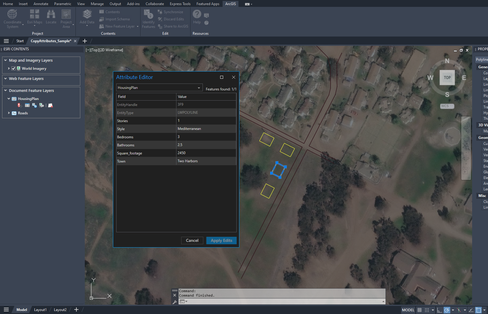

# Use Copy Attributes (Sample)

This sample AutoLISP command function copies the ArcGIS for AutoCAD attributes from one entity and applies them to another.


## Use case

This sample AutoLISP command function copies and applies ArcGIS for AutoCAD building attributes from one house to another on housing plans for Catalina Island.

## How it works 

The user designates the ArcGIS for AutoCAD feature layer to operate within. The user clicks an entity with the ArcGIS for AutoCAD attributes to be copied, and its attributes are recorded. Then, the user clicks another entity that will obtain the recorded attributes, and the attributes are applied.

## Use the sample

1. To prepare, download the [CopyAttributes.lsp](https://devtopia.esri.com/amb13827/AFA-Samples/blob/main/SampleCodeAndDemos/CopyAttributes/CopyAttributes.lsp) file from the GitHub folder, and download and open the [CopyAttributes_Sample.dwg](https://devtopia.esri.com/amb13827/AFA-Samples/blob/main/SampleCodeAndDemos/CopyAttributes/CopyAttributes_Sample.dwg) file from the GitHub folder. The AutoCAD sample drawing contains an ArcGIS for AutoCAD document feature layer of polygons for a few new homes on Catalina Island. A roads document feature layer is included for additional context. 

2.	View the housing plan data in ArcGIS for AutoCAD.

      

3. In the **Esri Contents** pane, on the **HousingPlan** document feature layer, click the **Attribute Table** button to view the ArcGIS for AutoCAD attributes. See how one feature differs from the others.

     

     

     (The location of the "Mediterranean" Style House)

     

     

5.	Load the LSP file from your computer and then type "copyAttributes" in the command line to access the tool.

      
   
5. Type the name of the target ArcGIS for AutoCAD feature layer in which you want to copy and designate attributes. In this case type "HousingPlan".

6. To select the source entity (the object that you want to copy ArcGIS for AutoCAD attributes from), click the building above the Mediterranean-style house.

7. To select the destination entity (the object that you want to copy the ArcGIS for AutoCAD attributes to), click the Mediterranean-style house. 

9. The ArcGIS for AutoCAD attributes are copied, and now the target building has the same attributes. 

   

## Demonstration video

ADD VIDEO HERE

## Sample AutoLISP

ArcGIS for AutoCAD AutoLISP sample CopyAttributes.lsp
``` LISP
;@@@@@@@@@@@@@@@@@@@@@@@@@@@@@@@@@@@@@@@@@@@@@@@@@@@@@@@@@@@@@@@@@@@@@@@@@@@@@@@@@@@@@@@@@@@@@@@@@@@@
; COMMAND TO COPY THE ARCGIS FOR AUTOCAD ATTRIBUTES FROM ONE ENTITY AND APPLY THEM TO ANOTHER
;@@@@@@@@@@@@@@@@@@@@@@@@@@@@@@@@@@@@@@@@@@@@@@@@@@@@@@@@@@@@@@@@@@@@@@@@@@@@@@@@@@@@@@@@@@@@@@@@@@@@

(defun c:copyAttributes ()
  
  ; Choose the feature layer in which to copy and assign ArcGIS attributes 
  (setq featureLayer (getstring "Enter the Feature Layer name: "))
  
  ; Gather attributes from the source entity
  (setq sourceEntity (car(entsel "Select the source entity: ")))
  (setq sourceAttributes (esri_attributes_get sourceEntity ))
  
  ; Assign the attributes to the destination entity
  (setq destEntity (car(entsel "\n Select the destination entity: ")))
  (esri_attributes_set destEntity featureLayer sourceAttributes)
)
```

## Relevant API

_The **copyAttributes** sample command uses the following ArcGIS for AutoCAD Lisp API functions:_

- [esri_attributes_get](https://doc.arcgis.com/en/arcgis-for-autocad/latest/commands-api/esri-attributes-get.htm) – This function gets an associated list of the field names and their attribute value.

- [esri_attributes_set](https://doc.arcgis.com/en/arcgis-for-autocad/latest/commands-api/esri-attribute-set.htm) – This function adds or modifies feature attributes on an entity of a feature layer.
