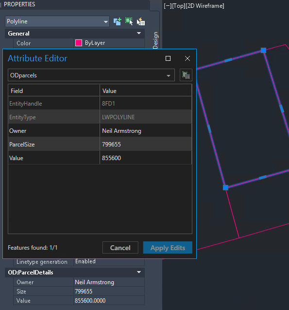
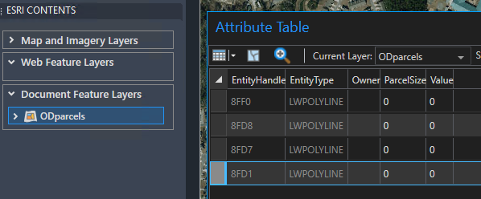
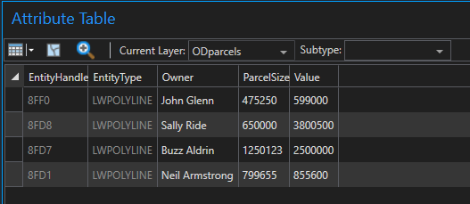

# Copy Object Data to Fields

This sample routine copies the Object Data from a feature entity to the existing ArcGIS attribute fields of a feature layer.





## Description
This example copies the Object Data from a set of Parcel entities in Wilmington, North Carolina, to existing attribute fields on the feature layer.

## Requirements
- Attribute fields must exist on the ArcGIS feature layer that match the Object Data field names.
- For a document feature layer, the user can add the necessary attribute fields if they do not exist on the layer.
- For a web feature layer, these attribute fields must exist on the published layer before it is added to the drawing.


## Use the sample  

1. Open the [CopyObjectData_Sample.dwg](CopyObjectData_Sample.dwg) file and load the [CopyObjectDataToFields.lsp](CopyObjectDataToFields.lsp) file.
2. To better understand the sample drawing, select one of the parcel entities and review the Object Data displayed under the **Properties** panel. Review the blank attribute table field values and note that the values are NULL.



3. To copy the Object Data to the document feature layer, run the `AFA_Samples_CopyObjectDataToFields` command and provide the feature layer name, **ODparcels**.
4. Notice the Command return now contains three different key/value pairs of Object Data for each entity.
5. The attribute table is successfully updated with the Object Data information.




## How it works

1.	Gets the name of the feature layer and selected entities from the user
2.	Uses [```esri_featurelayer_select```](https://doc.arcgis.com/en/arcgis-for-autocad/latest/commands-api/esri-featurelayer-select.htm) to get a selection set of all the polygons on the feature layer
3.	Gets all Object Data key/value pairs from the features
4.	Uses [```esri_attributes_set```](https://doc.arcgis.com/en/arcgis-for-autocad/latest/commands-api/esri-attribute-set.htm) to modify feature attributes on each entity of the feature layer


## Relevant  API

- [```esri_featurelayer_select```](https://doc.arcgis.com/en/arcgis-for-autocad/latest/commands-api/esri-featurelayer-select.htm) – This function returns an AutoCAD selection set filtered by the specified feature layer.

- [```esri_attributes_set```](https://doc.arcgis.com/en/arcgis-for-autocad/latest/commands-api/esri-attribute-set.htm) – This function adds or modifies feature attributes on an entity of a feature layer.

 


