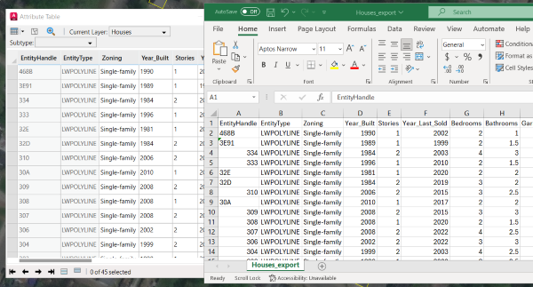
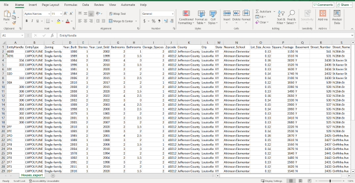

# Export Attributes to CSV

This sample routine exports a feature layer's attributes to a CSV file.



## Description
This example exports home attributes from Louisville, Kentucky, to a well-formatted CSV file suitable for use in Microsoft Excel or other applications. Within the AutoCAD sample drawing, there is a polygon document feature layer depicting a cluster of homes in Louisville, Kentucky, each accompanied by a range of attributes.

## Use the sample  

1. Open the [ExportToCSV_Sample.dwg](ExportToCSV_Sample.dwg) drawing and load the [ExportToCSV.lsp](ExportToCSV.lsp)  file.

3. To better understand our sample drawing, open the attribute table of the "Houses" layer and review the list of attributes and field names.

4. To export these attributes to a CSV, run the ```EXPORTTOCSV``` command. Select a file path where the file should be written to. 

6. Open the newly created CSV in your application of choice and explore the same attributes seen in ArcGIS for AutoCAD.

    

## How it works

1. Get the name of the feature layer from the user

2. Create a blank CSV file

3. Get the field names of the feature layer using [```esri_fielddef_names```](https://doc.arcgis.com/en/arcgis-for-autocad/latest/commands-api/esri-fielddef-names.htm)

4. Get all the attributes of the feature layer using [```esri_featurelayer_getattributes```](https://doc.arcgis.com/en/arcgis-for-autocad/latest/commands-api/esri-featurelayer-getattributes.htm)

5. Write the field names and attributes to the CSV file


## Relevant API
_The **exportToCSV** sample command uses the following ArcGIS for AutoCAD Lisp API functions:_
- [esri_fielddef_names](https://doc.arcgis.com/en/arcgis-for-autocad/latest/commands-api/esri-fielddef-names.htm) – This function returns a list of field names for an existing document or web feature layer.

- [esri_featurelayer_getattributes](https://doc.arcgis.com/en/arcgis-for-autocad/latest/commands-api/esri-featurelayer-getattributes.htm) – This function returns a list of associated lists of all the attributes of all the features of the specified feature layer in the drawing.
