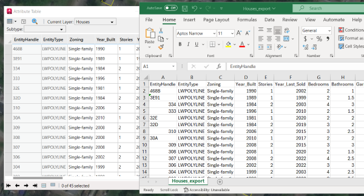
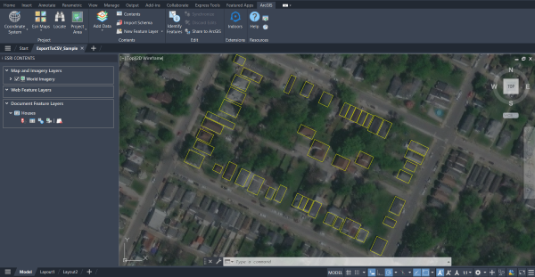
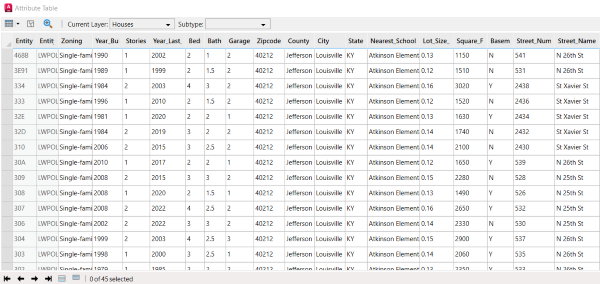
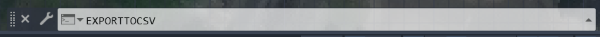
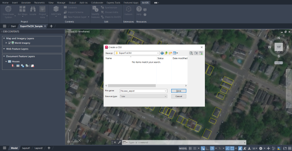
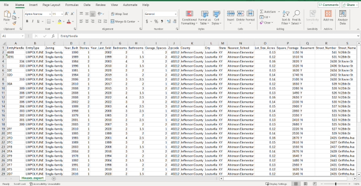

# Use Export Attribute Table to CSV (Sample)

This sample AutoLISP command function exports an ArcGIS for AutoCAD feature layer's ArcGIS for AutoCAD attribute table as a CSV file.



## Use case
This sample AutoLISP command function exports ArcGIS for AutoCAD attributes for homes in Louisville, Kentucky.   
    
## How it works

The user designates the ArcGIS for AutoCAD feature layer to have its ArcGIS for AutoCAD attribute table exported and is prompted to choose a directory location for the new CSV file. The ArcGIS for AutoCAD attribute field names are collected in a comma-delineated string and written to the CSV file. Then, the attribute values are collected in a comma-delineated string and written to the CSV file. 

## Use the sample  

1. To prepare, download the [ExportToCSV.lsp](ExportToCSV.lsp) file from the GitHub folder, and download and open the [ExportToCSV_Sample.dwg](ExportToCSV_Sample.dwg) file from the GitHub folder. The AutoCAD sample drawing contains an ArcGIS for AutoCAD document feature layer of polygons for a block of homes in Louisville, Kentucky, with many ArcGIS for AutoCAD attributes. 
2. View the housing plan data in ArcGIS for AutoCAD.

    

3. In the Esri Contents pane, on the Houses document feature layer, click the Attribute Table button to view the ArcGIS for AutoCAD attributes. Export the ArcGIS for AutoCAD attributes to a CSV file.

    
    
4. Load the LSP file from your computer and then type "exportToCSV" in the command line to access the custom tool.

    
    
5. Type the name of the target ArcGIS for AutoCAD feature layer to have its attributes exported, "Houses". The feature layer name is automatically populated in the file name. Choose where in your directory to save the CSV file.  

    
    
6. An AutoCAD message notifies that the export was successful. The ArcGIS for AutoCAD attribute table data is now available as a CSV to open in a spreadsheet, such as Excel. 

    

## Demonstration video

[](https://mediaspace.esri.com/media/t/1_aprzuxnu)

## Sample AutoLISP
ArcGIS for AutoCAD AutoLISP sample ExportToCSV.lsp
``` LISP
;@@@@@@@@@@@@@@@@@@@@@@@@@@@@@@@@@@@@@@@@@@@@@@@@@@@@@@@@@@@@@@@@@@@@@@@@@@@@@@@@@@@@@@@@@@@@@@@@@@@@
; COMMAND TO EXPORT AN ARCGIS FOR AUTOCAD FEATURE LAYER'S ARCGIS FOR AUTOCAD ATTRIBUTE TABLE AS A CSV FILE
;@@@@@@@@@@@@@@@@@@@@@@@@@@@@@@@@@@@@@@@@@@@@@@@@@@@@@@@@@@@@@@@@@@@@@@@@@@@@@@@@@@@@@@@@@@@@@@@@@@@@

(defun c:exportToCSV ()
  
  ; Choose the feature layer and the file location for the new CSV
  (setq featureLayer (getstring "Enter the Feature Layer name : "))
  (setq csvPath (getfiled "Create a CSV" (strcat featureLayer "_export") "csv" 1))
  
  ; Write to the new file
  (if (setq csvFile (open csvPath "w")) 
      (progn     
        
        ;; Process the field names and write them into CSV format
        (setq fieldNameList (esri_fielddef_names featureLayer))
        (setq attString "")
        (foreach fieldName fieldNameList
          (setq attString (strcat attString fieldName ","))
        )
        (setq lineLength (strlen attString))
        (setq attString (substr attstring 1 (1- lineLength)))
        (write-line attString csvFile)
        ;; End of field name processing 
        
        ;; Process the field values and write them into CSV format
        (setq rawFieldResults (esri_featurelayer_getattributes featureLayer))
        (setq numberOfFeatures (length rawFieldResults))
        (if (< 500 numberOfFeatures) (alert "This may take a while"))
        (setq featureEntry "")
        (foreach entry rawFieldResults
          (setq attFieldPair entry) 
          (foreach fieldValue attFieldPair
            (setq fieldValue (cdr fieldValue))
            (if (= 'INT (type fieldValue))
              (setq fieldValue (itoa fieldValue))
            )
            (if (= 'REAL (type fieldValue))
              (setq fieldValue (rtos fieldValue 2 2))
            )
            (if (= nil (type fieldValue))
              (setq fieldValue "")
            )
            (setq featureEntry (strcat featureEntry fieldValue ","))
          )
          (setq lineLength (strlen featureEntry))
          (setq featureEntry (substr featureEntry 1 (1- lineLength)))
          (write-line featureEntry csvFile)
          (setq featureEntry "")
        )
        ;; End of field value processing

        ; Close the file and show export completion
        (close csvFile)
        (alert (strcat "export complete: " csvPath))
      )
      (princ "\nUnable to create/modify file.")
    )
)
```

## Relevant API

_The **exportToCSV** sample command uses the following ArcGIS for AutoCAD Lisp API functions:_

- [esri_fielddef_names](https://doc.arcgis.com/en/arcgis-for-autocad/latest/commands-api/esri-fielddef-names.htm) – This function returns a list of field names for an existing document or web feature layer.

- [esri_featurelayer_getattributes](https://doc.arcgis.com/en/arcgis-for-autocad/latest/commands-api/esri-featurelayer-getattributes.htm) – This function returns a list of associated lists of all the attributes of all the features of the specified feature layer in the drawing.
