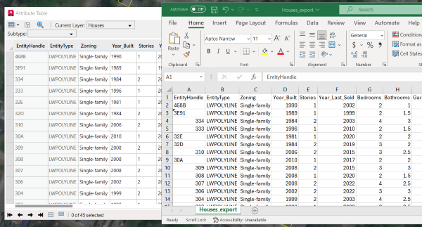
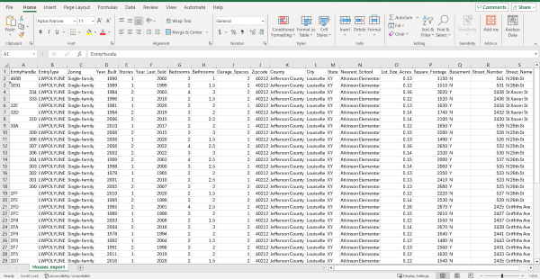

# Export Attributes to CSV

This sample routine exports a feature layer's attributes to a CSV file.



## Description
This example exports home attributes from Louisville, Kentucky, to a well-formatted CSV file suitable for use in Microsoft Excel or other applications. Within the AutoCAD sample drawing, there is a polygon document feature layer depicting a cluster of homes in Louisville, Kentucky, each accompanied by a range of attributes.

## Use the sample  

1. Open the [ExportToCSV_Sample.dwg](ExportToCSV_Sample.dwg) drawing and load the dll you built in Visual Studio.

2. To better understand our sample drawing, open the attribute table of the "Houses" layer and review the list of attributes and field names.

3. To export these attributes to a CSV file, run the ```AFA_Samples_ExportToCSV``` command. Select a file path where the file should be written to. 

4. Open the newly created CSV in your application of choice and explore the same attributes seen in ArcGIS for AutoCAD.

    

## How it works

1. Create a blank CSV file

2. Get the field names of the feature layer using [```FieldDefinition.Names```](https://doc.arcgis.com/en/arcgis-for-autocad/latest/commands-api/fielddefinitionnames-net.htm)

3. Get all the attributes of the feature layer using [```FeatureLayer.GetAttributes```](https://doc.arcgis.com/en/arcgis-for-autocad/latest/commands-api/featurelayergetattributes-net.htm)

4. Write the field names and attributes to the CSV file


## Relevant API
_The **AFA_Samples_ExportToCSV** sample command uses the following ArcGIS for AutoCAD .NET API methods:_
- [```FieldDefinition.Names```](https://doc.arcgis.com/en/arcgis-for-autocad/latest/commands-api/fielddefinitionnames-net.htm) – This method returns a collection of field names for an existing document or web feature layer.

- [```FeatureLayer.GetAttributes```](https://doc.arcgis.com/en/arcgis-for-autocad/latest/commands-api/featurelayergetattributes-net.htm) – This method returns a collection of dictionaries of all the field names and values for all the features in the specified feature layer in the drawing.

