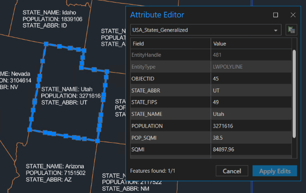
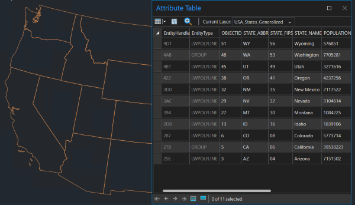

# Label from Multiple Fields

This sample routine concatenates multiple ArcGIS attribute values into one MText entity.



## Description

This sample AutoLISP command places an MText entity near selected features with state name, population, and state abbreviation data from ArcGIS attribute values. The accompanying sample drawing contains a document feature layer of polygons of the Western United States with demographic attributes.

## Use the sample

1. Open the [LabelFromMultipleFields.dwg](LabelFromMultipleFields_Sample.dwg) drawing and load the [LabelFromMultipleFields.lsp](LabelFromMultipleFields.lsp) file.

2. To better understand the sample drawing, open the attribute table of the **USA_States_Generalized** layer and review the attribute fields and values.

     

     

3. To place a label, run the ```AFA_Samples_LabelFromMultipleAttributes``` command, select a feature to label, and choose a location for the label.

4. Repeat labeling features until you are ready to exit the command.


## How it works 

1. Sets the attribute fields to use for the label
2. Prompts for the feature to label
3. Uses [```esri_attributes_get```](https://doc.arcgis.com/en/arcgis-for-autocad/latest/commands-api/esri-attributes-get.htm) to read the attributes from the selected feature
4. Concatenates the relevant attribute values with a new line separator 
5. Selects the location for the label

## Relevant  API
_The **AFA_Samples_LabelFromMultipleAttributes** sample command uses the following ArcGIS for AutoCAD Lisp API function:_
- [esri_attributes_get](https://doc.arcgis.com/en/arcgis-for-autocad/latest/commands-api/esri-attributes-get.htm) – This function gets an associated list of the field names and their attribute values.
