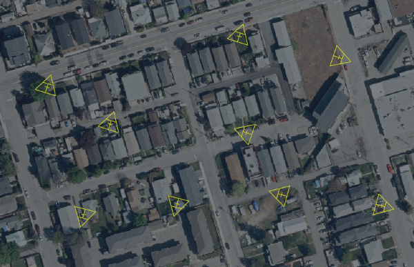
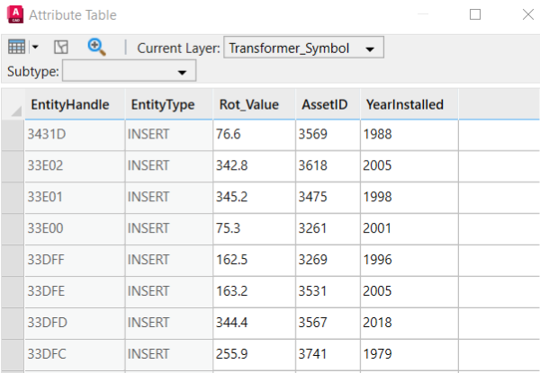
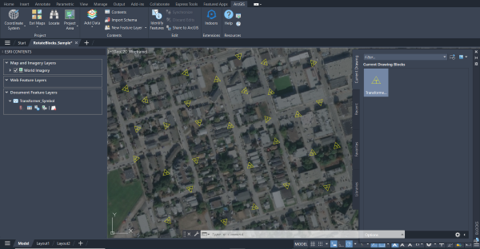

# Rotate Blocks to Field Value
This sample routine rotates block inserts to a rotation value stored as an attribute.



## Description
This example rotates AutoCAD blocks inserts that represent electric transformers in Penticton, Canada. ArcGIS for AutoCAD can currently rotate blocks based on field values named "Angle" or "Rotation". However, in this case, the sample utilizes uses a field named "rot_value" for this purpose. The accompanying sample drawing contains a feature layer with blocks depicting transformer locations.

## Explore the sample
1. Open the [RotateBlocks_Sample.dwg](RotateBlocks_Sample.dwg) and load the [RotateBlocks.lsp](RotateBlocks.lsp) file.

3. To better understand our sample drawing, open the attribute table of the "Transformer_Symbol" layer and review the current properties.  Note the values in the "rot_value" field, this is where we will pull the rotation for the blocks from.  

    
    
4. To apply the rotation values to the blocks, run the ```rotateBlocks``` command and provide "Transformer_Symbol" as the feature layer name and "rot_value" as the field name. 

5. The blocks have now been rotated to the values from the rot_value field. Run the command again to pick up any changes you make to the field values. 

    


## How it works

1. Get the name of the feature layer and the field to use for rotation from the user

2. Use [```esri_featurelayer_select```](https://doc.arcgis.com/en/arcgis-for-autocad/latest/commands-api/esri-featurelayer-select.htm) to get a selection set of all the points on the feature layer

3. Use [esri_attributes_get](https://doc.arcgis.com/en/arcgis-for-autocad/latest/commands-api/esri-attributes-get.htm) to retrieve the rotation value from the selected field for each entity

4. Set the rotation value of the block insert to the rotation value from the field (must first be converted to radians)

   

## Sample AutoLISP

ArcGIS for AutoCAD AutoLISP sample RotateBlocks.lsp
```LISP
;Description:
;============
;This sample routine rotates block entities to a value defined in an ArcGIS attribute.
;
;Inputs:  
;========
;Name of feature layer, name of attribute field with rotation values
;
;Outputs:
;========
;None

(defun rotateBlocks (flName rotAttName)
  
  ; Choose and select the feature layer that contains the blocks with rotation attributes
  (setq flSelection (esri_featurelayer_select flName))
  (setq flLength (sslength (esri_featurelayer_select flName)))
  (setq entCount 0)
  
  ; Loop through each entity in the feature layer
  (repeat flLength 
    (setq ss (ssadd))
    (setq entName (ssname flSelection entCount))
    (ssadd entName ss)
    
    ; Get the entity's rotation attribute value from the rotation field
    (setq rotValue 
      (esri_attributes_get entName 
        (list 
          (cons "FLNAME" flName)
          (cons "FIELDNAME" rotAttName)
        )
      )
    )
    (setq rotValue (cdr (nth 0 rotValue)))
    
    ; Set the rotation value to float if the rotation value is text
    (cond
      ((= (type rotValue) 'STR )
        (setq rotValue (atof rotValue))
      )
    )      

    ; Rotate the block with the rotation value
    (setq rotValueRadians (* pi (/ rotValue 180.0)))
    (setq ed (entget entName))
    (entmod (subst (cons 50 rotValueRadians)(assoc 50 ed) ed))
    
    (setq ss nil)
    (setq entCount (+ 1 entCount))
  )
)
```
## Relevant API
- [esri_featurelayer_select](https://doc.arcgis.com/en/arcgis-for-autocad/latest/commands-api/esri-featurelayer-select.htm) – This function returns an AutoCAD selection set filtered by the specified feature layer.
  
- [esri_attributes_get](https://doc.arcgis.com/en/arcgis-for-autocad/latest/commands-api/esri-attributes-get.htm) – This function gets an associated list of the field names and their attribute values.
