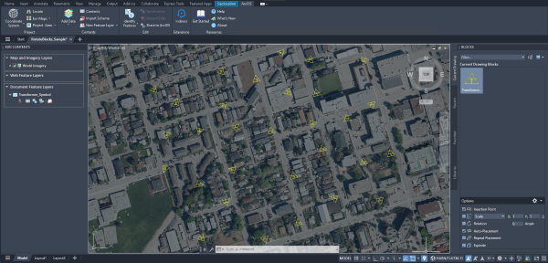

# Rotate Blocks to Field Value
This sample routine rotates block inserts to a rotation value stored as an attribute.


## Description
This example rotates AutoCAD block inserts that represent electric transformers in Penticton, Canada. ArcGIS for AutoCAD automatically rotates blocks based on the values of fields named "Angle" or "Rotation". However, in this case, the sample uses a field named "Rot_Value" for this purpose. The accompanying sample drawing contains a feature layer with blocks depicting transformer locations.

## Explore the sample
1. Open the [RotateBlocks_Sample.dwg](RotateBlocks_Sample.dwg) and load the dll you built in Visual Studio.

2. To better understand our sample drawing, open the attribute table of the "Transformer_Symbol" layer and review the current properties.  Note the values in the "Rot_Value" field, this is where we will pull the rotation for the blocks from.  

    
    
3. To apply the rotation values to the blocks, run the ```AFA_Samples_RotateBlocksFromField``` command.

4. The blocks have now been rotated to the values from the "Rot_Value" field. Run the command again to pick up any changes you make to the field values. 

   

## How it works

1. Use [```FeatureLayer.Select```](https://doc.arcgis.com/en/arcgis-for-autocad/latest/commands-api/featurelayerselect-net.htm) to get a selection set of all the points on the feature layer

2. Use [```Attributes.Get```](https://doc.arcgis.com/en/arcgis-for-autocad/latest/commands-api/attributesget-net.htm) to retrieve the rotation value from the selected field for each entity

3. Set the rotation value of the block insert to the rotation value from the field (must first be converted to radians)


## Relevant API
_The **AFA_Samples_RotateBlocksFromField** sample command uses the following ArcGIS for AutoCAD .NET API methods:_
- [```FeatureLayer.Select```](https://doc.arcgis.com/en/arcgis-for-autocad/latest/commands-api/featurelayerselect-net.htm) – This method returns an AutoCAD selection set filtered by the specified feature layer.
  
- [```Attributes.Get```](https://doc.arcgis.com/en/arcgis-for-autocad/latest/commands-api/attributesget-net.htm) – This method gets a dictionary of the field names and their attribute values.

