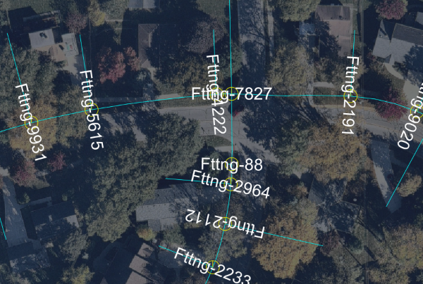
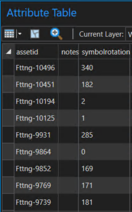
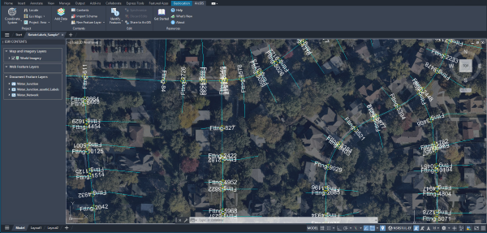

# Rotate Labels to Field Values

This sample routine rotates labels based on rotation values stored as attributes.



## Description

This example rotates asset ID labels on water junctions in Naperville, Illinois. The accompanying sample drawing contains a feature layer with labeled water junctions.

## Use the sample 
1.    Open the [RotateLabels_Sample.dwg](RotateLabels_Sample.dwg) file and load the dll you built in Visual Studio.

2. To better understand the sample drawing, open the attribute table of the **Water_Junction** document feature layer. The rotation values for the labels are stored in the **symbolrotation** attribute field. The labels on the water junction data were generated from the **assetid** attribute field using the [```esri_generatelabel```](https://doc.arcgis.com/en/arcgis-for-autocad/latest/commands-api/esri-generatelabel-esri-generate-label.htm) command.

    

3.	To apply the rotation values to the labels, run the `AFA_Samples_RotateLabelsFromField` command.   

4.	The labels have been rotated according to the values from the **symbolrotation** field. Run the command again to pick up any changes you make to the field values.

      

## How it works
1. Uses [```FeatureLayer.Select```](https://doc.arcgis.com/en/arcgis-for-autocad/latest/commands-api/featurelayerselect-net.htm) to create a selection set of each entity in the feature layer 
2. Uses [```Attributes.Get```](https://doc.arcgis.com/en/arcgis-for-autocad/latest/commands-api/attributesget-net.htm) to retrieve the rotation value from the selected field for each entity
3. Uses [```FeatureLabel.Get```](https://doc.arcgis.com/en/arcgis-for-autocad/latest/commands-api/labelget-net.htm) to retrieve the entity name of the label
4. Sets the rotation value of the label to the rotation value from the field (must first be converted to radians)

## Relevant API

_The **AFA_Samples_RotateLabelsFromField** sample command uses the following ArcGIS for AutoCAD .NET API methods:_

- [```FeatureLayer.Select```](https://doc.arcgis.com/en/arcgis-for-autocad/latest/commands-api/featurelayerselect-net.htm) – This method returns an AutoCAD selection set filtered by the specified feature layer.
        
- [```Attributes.Get```](https://doc.arcgis.com/en/arcgis-for-autocad/latest/commands-api/attributesget-net.htm) – This method gets a dictionary of the field names and their attribute values.
    
- [```FeatureLabel.Get```](https://doc.arcgis.com/en/arcgis-for-autocad/latest/commands-api/labelget-net.htm) – This method returns the AutoCAD ObjectId value of the text entity label linked to a specified feature attribute field of a feature.
