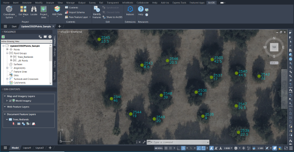

# Update COGO Point Descriptions from Field

This sample routine updates Autodesk Civil 3D COGO point descriptions with values from ArcGIS attributes. 


## Description

This example updates Civil 3D COGO point descriptions for trees in Redlands, California. Using the ArcGIS for AutoCAD API it updates the trees point descriptions with the name of the trees species type. This sample includes a drawing created with Civil 3D. The drawing includes a document feature layer that includes COGO points located in Redlands, California representing trees.


## Use the sample
1. Open the [UpdateCOGOPoints_Sample.dwg](UpdateCOGOPoints_Sample.dwg) drawing and load the [UpdateCOGOPointsFromField.lsp](UpdateCOGOPointsFromField.lsp) file.

2. To get familiar with the data explore the attribute table and the prospector. The points are gathered in a point group with a tree point style and a point label style that displays point numbers and descriptions. The point group property overrides are set to maintain the tree point style and the point label style. 

   

   

3. To update the COGO point descriptions run the ```updateCOGOPointsFromField``` command. Use the "TreeGenus" field to update the values on the points from the "Trees_Redlands" layer. 

   

4. Examine the COGO points to confirm the descriptions now include the tree genus values. 

   


## How it works

1. Get the name of the feature layer and the field from the user
2. Use [```esri_featurelayer_select```](https://doc.arcgis.com/en/arcgis-for-autocad/latest/commands-api/esri-featurelayer-select.htm) to get a selection set of all the points on the feature layer
3. Use [```esri_attributes_get```](https://doc.arcgis.com/en/arcgis-for-autocad/latest/commands-api/esri-attributes-get.htm) to read the "TreeGenus" field value from every point
4. Set the "TreeGenus" attribute value as the COGO point description using [```esri_feature_changeelementtype```](https://doc.arcgis.com/en/arcgis-for-autocad/latest/commands-api/esri-feature-changeelementtype.htm)

## Sample AutoLISP
ArcGIS for AutoCAD AutoLISP sample UpdateCOGOPointsFromField.lsp
``` LISP
(defun c:updateCOGOPointsFromField ()
  
  ; Get the target feature layer and attribute field for COGO point descriptions, and select the feature layer
  (setq flName (getstring "Enter the Feature Layer name : "))
  (setq attName (getstring "Enter the attribute field name for COGO point descriptions : "))
  (setq flSelection (esri_featurelayer_select flName))
  (setq flLength (sslength (esri_featurelayer_select flName)))
  
  ; Loop through every COGO point and gather its attribute field value 
  (setq entCount 0)
  (repeat flLength 
    (setq ss (ssadd))
    (setq entName (ssname flSelection entCount))
    (ssadd entName ss)
    (setq attValue 
      (esri_attributes_get entName 
        (list 
          (cons "FLNAME" flName)
          (cons "FIELDNAME" attName)
        )
      )
    )
    (setq attValue (cdr (nth 0 attValue)))
    
    ; Set the COGO point description to the retrieved attribute value
    (esri_feature_changeElementType ss
      (list 
        (cons "Type" "AECC_COGO_POINT") 
        (cons "Description" attValue)
      )
    )
    (setq ss nil)
    (setq entCount (+ 1 entCount))
  )
)
```


## Relevant API

- [esri_feature_changeElementType](https://doc.arcgis.com/en/arcgis-for-autocad/latest/commands-api/esri-feature-changeelementtype.htm) – The function changes the element type of a selection set of point features.
  
- [esri_featurelayer_select](https://doc.arcgis.com/en/arcgis-for-autocad/latest/commands-api/esri-featurelayer-select.htm) – This function returns an AutoCAD selection set filtered by the specified feature layer.
  
- [esri_attributes_get](https://doc.arcgis.com/en/arcgis-for-autocad/latest/commands-api/esri-attributes-get.htm) – This function gets an associated list of the field names and their attribute values.
