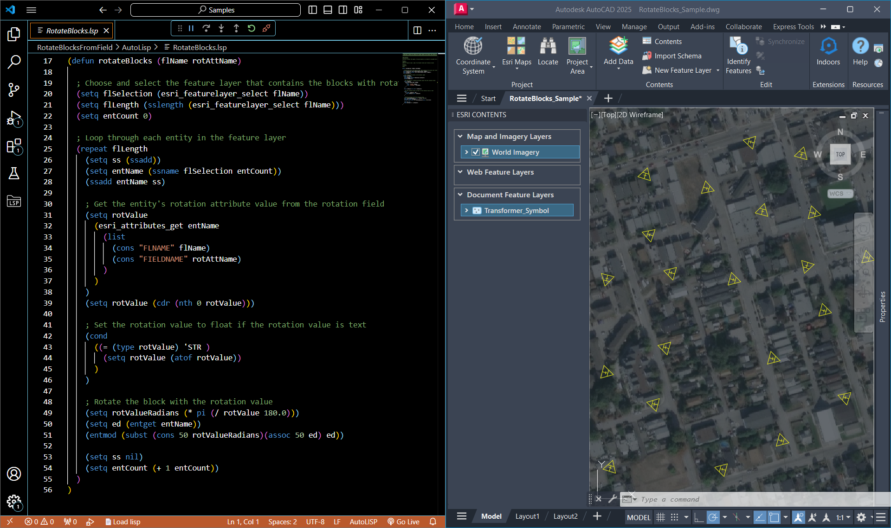

# ArcGIS for AutoCAD API Samples




## __Introduction__
Welcome to our collection of samples that demonstrate the capabilities of the ArcGIS for AutoCAD API. This projects goal is to inspire users to develop their own custom AutoLISP code, enhancing their projects and workflows.

Below you will find a series of samples to inspire your own development. Each sample demonstrates how to use the ArcGIS for AutoCAD API functions to automate common workflows using real world examples. 

* A description of the sample
* Code file for the sample command
* A sample drawing file to demonstrate the command
* Links to the relevant API method documentation
* Explanation on how the API methods are used within the sample

## Samples

- [Calculate New Field](Samples/CalculateNewField/AutoLisp) \- Calculates the values of a new attribute field by applying a mathematical expression onto the values of other fields.
- [Copy Attributes](Samples/CopyAttributes/AutoLisp)  \- Copies the ArcGIS for AutoCAD attributes from one entity and applies them to another.
- [Export Attributes To CSV](Samples/ExportAttributesToCSV/AutoLisp)  \- Exports a feature layers attributes to a CSV file.
- [Rotate Blocks to Field Value](Samples/RotateBlocksFromField/AutoLisp) - Rotates block inserts to a rotation value stored as an attribute.
- [Update COGO Points From Field (Civil 3D)](Samples/UpdateCOGOPointsFromField/AutoLisp)  \- Updates Autodesk Civil 3D COGO point descriptions with values from ArcGIS attributes. 

_Disclaimer: These samples are not covered under Esri's technical support._

## How to use a sample
1. [Download ArcGIS for AutoCAD](https://www.esri.com/en-us/arcgis/products/arcgis-for-autocad/overview)
2. Download the LSP and other files for the selected sample.
3. Load the LSP file. (Type ```APPLOAD``` in the AutoCAD command line.)

## Contributing

Esri welcomes contributions to our open source projects on GitHub. Please see our [guidelines for contributing](https://github.com/esri/contributing).

We do not currently accept new PRs for full features (e.g. a new sample or a significant change to the samples) but we encourage you to submit issues for:

- Bugs you find while using the samples.
- Enhancement requests for new code samples or new functionality in the sample viewers.

---

[](https://www.esri.com/en-us/arcgis/products/arcgis-for-autocad/overview#download)
