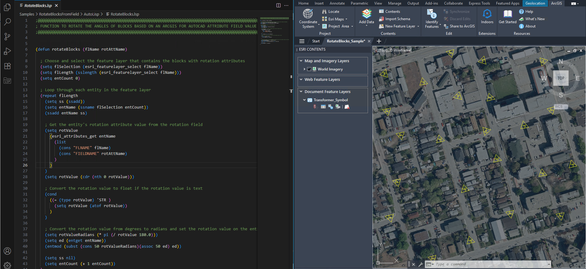

# ArcGIS for AutoCAD API Samples



Welcome to our collection of samples that demonstrate the capabilities of the ArcGIS for AutoCAD API. This project's goal is to inspire you to develop your own ArcGIS for AutoCAD customizations, enhancing your projects and workflows.

Below you will find a series of samples that demonstrate how to use the ArcGIS for AutoCAD API methods to automate common workflows using real world examples. Each sample includes the following:

* A description of the sample

* Code file for the sample command

* A sample drawing file to demonstrate the command

* Links to the relevant API method documentation

* Explanation on how the API methods are used within the sample

  
## Samples
- [Calculate New Field](Samples/CalculateNewField/) - Calculates the values of a new attribute field by applying a mathematical expression onto the values of other fields.
- [Copy Attributes](Samples/CopyAttributes/)  - Copies the ArcGIS for AutoCAD attributes from one entity and applies them to another.
- [Export Attributes to CSV](Samples/ExportAttributesToCSV/)  - Exports a feature layers attributes to a CSV file.
- [Rotate Blocks to Field Value](Samples/RotateBlocksFromField/) - Rotates block inserts to a rotation value stored as an attribute.
- [Update COGO Points from Field (Civil 3D)](Samples/UpdateCOGOPointsFromField/) - Updates Autodesk Civil 3D COGO point descriptions with values from ArcGIS attributes.
- [Alignment to M-Aware Line](https://github.com/Esri/ArcGIS-for-AutoCAD-API-Samples/tree/main/Samples/AlignmentToMPolyline/NET) (.NET Only) - Generate a Polyline2d feature with M-Values from an Autodesk Civil3D horizontal alignment

## AutoLISP Instructions
1. [Download ArcGIS for AutoCAD](https://www.esri.com/en-us/arcgis/products/arcgis-for-autocad/overview)
2. Download the LSP and other files for the selected sample.
3. Load the LSP file. (Type ```APPLOAD``` in the AutoCAD command line.)

## .NET Instructions
1. [Download ArcGIS for AutoCAD](https://www.esri.com/en-us/arcgis/products/arcgis-for-autocad/overview)
2. If you want to modify or debug sample code, you can clone this repo.
3. Open Visual Studio 2022 or higher.
4. Open the [project file](AFASamples.csproj) in Visual Studio.
5. Build the solution.
6. Load the .NET dll created by Visual Studio. (Type ```NETLOAD``` in the AutoCAD command line.)

## Requirements

* [Supported Autodesk AutoCAD or Autodesk Civil 3D Version](https://doc.arcgis.com/en/arcgis-for-autocad/latest/get-started/system-requirements.htm)
* [A supported version of ArcGIS for AutoCAD](https://support.esri.com/en-us/products/arcgis-for-autocad/life-cycle) - [Download Here](https://www.esri.com/en-us/arcgis/products/arcgis-for-autocad/overview#download)

## Resources

* [ArcGIS for AutoCAD API Documentation](https://doc.arcgis.com/en/arcgis-for-autocad/latest/commands-api/automation.htm)
* [ArcGIS for AutoCAD Resources](https://www.esri.com/en-us/arcgis/products/arcgis-for-autocad/resources)
* [Autodesk Developer API Resources](https://aps.autodesk.com/developer/overview/autocad)

## Issues

Find a bug or want to request a new feature?  Please let us know by submitting an issue.

## Contributing

Esri welcomes contributions to our open source projects on GitHub. Please see our guidelines for contributing.

We do not currently accept new PRs for full features (e.g. a new sample or a significant change to the samples) but we encourage you to submit issues for:

Bugs you find while using the samples.
Enhancement requests for new code samples or new functionality in the sample viewer

## Licensing
Copyright 2024 Esri

Licensed under the Apache License, Version 2.0 (the "License");
you may not use this file except in compliance with the License.
You may obtain a copy of the License at

   http://www.apache.org/licenses/LICENSE-2.0

Unless required by applicable law or agreed to in writing, software
distributed under the License is distributed on an "AS IS" BASIS,
WITHOUT WARRANTIES OR CONDITIONS OF ANY KIND, either express or implied.
See the License for the specific language governing permissions and
limitations under the License.

A copy of the license is available in the repository's [license.txt](license.txt) file.
